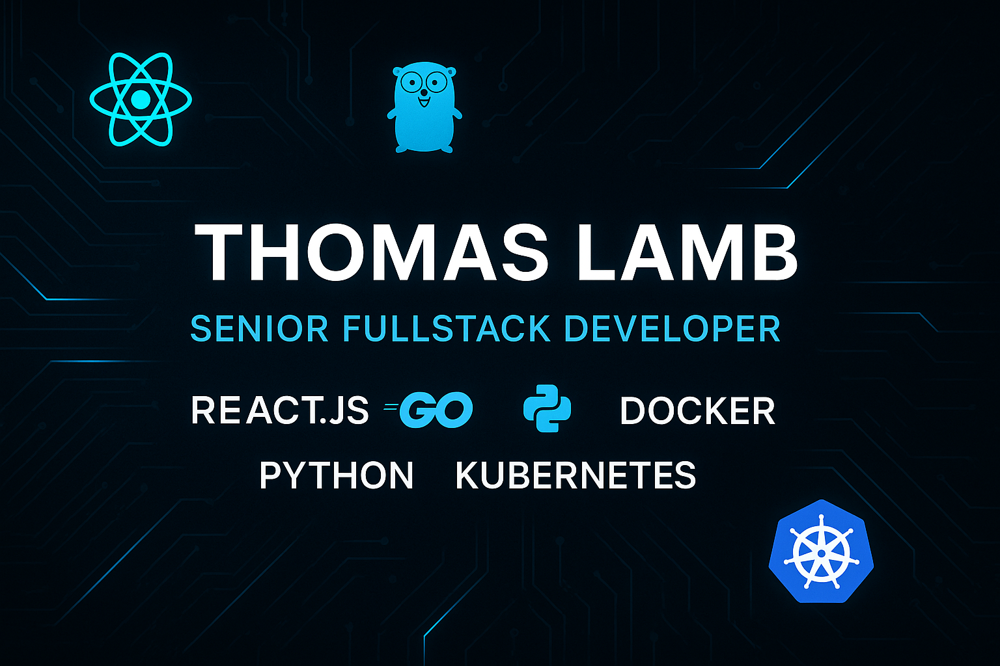

# Hi there! I am Thomas Lamb

I’m a Full-Stack Developer with hands on experience building scalable, high performance
web applications with React.js, Next.js, Python and GoLang. I love to create intuitive, fast and
responsive interfaces while engineering robust backends that handle data efficiently and reliably.
I love to combine modern frontend frameworks like React and Next.js with powerful backend
technologies like Golang and Python to deliver end to end solutions. My experience includes
designing APIs, performance optimization and deploying applications to cloud with Docker and
Kubernetes. I’m passionate about cleaning architecture, maintainable code and building products
that balance usability, performance and scalability. Whether it’s a dynamic web platform or a
complex backend service, I focus on building solutions that matter.

## About Me
- **Currently working on**: Sr Software Engineer
- **Currently learning**: Gen AI
- **How to reach me**: +44 7893 951814
- **Gmail**: thomas.lamb.tech@gmail.com
- **Telegram**: https://t.me/devw3b3

---

## My Tech Stack
Main languages and frameworks:
- **Languages**: , , , , 
- **Frameworks/Libraries**: , ,, , , , </a> , 
- **Tools/Platforms**:  , , , 

Thanks for visiting my profile!
